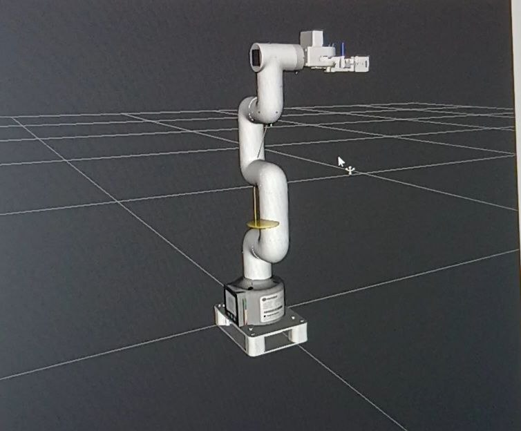
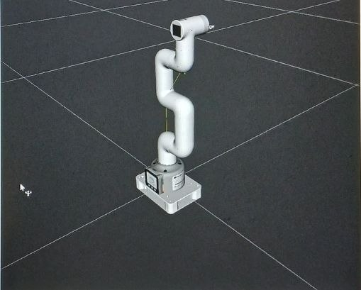

# 🤖 ArmBot: MyCobot ROS 2 Jazzy Project

This repository contains the complete implementation of the **MyCobot** robotic arm project using **ROS 2 Jazzy** on **Ubuntu 24.04 (Noble Numbat)**.

---

## 📸 Project Preview
<p align="center">
  
  
</p>

---

## 🚀 Features
- **ROS 2 Jazzy Integration:** Fully compatible with the latest ROS 2 LTS distribution.
- **Robot Visualization:** Optimized Rviz2 configuration for monitoring joints and movements.
- **Hardware Communication:** Integrated drivers for MyCobot arm control.
- **Complete Workspace:** Includes all necessary dependencies and launch files.

---

## 🛠️ Installation & Setup

### Prerequisites
Make sure you have **ROS 2 Jazzy** installed on your system.

### Step 1: Build the Project
Open your terminal and navigate to your workspace to build the packages:
```bash
cd ~/mycobot_ros2
colcon build
````
### Step 2: Source the Environment
After a successful build, you must source the workspace in every new terminal:
```bash
source install/setup.bash
````
###How to Run
To launch the robot visualization and control nodes, execute the following command:
```bash
ros2 launch mycobot_280 slider_control.launch.py model:=/home/amira/mycobot_ros2/src/mycobot_description/urdf/mycobot_280_pi/mycobot_280_pi_adaptive_gripper.urdf
````
This project was co-authored and implemented by the team:
Amira Malak Daoui
